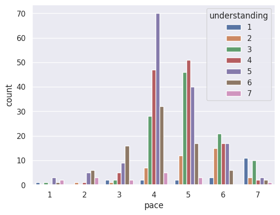
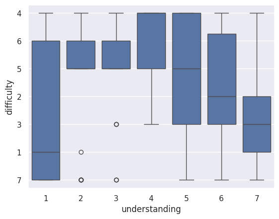
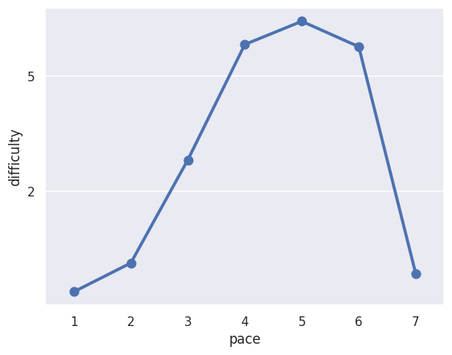

---
# Do not edit the text between these lines!
layout: default
---

# Comp110 Data Analysis: The Benefits to Lecture recordings
### By: Joanna Wang 
## My Idea
I will look more closely on whether students who have a lower understanding of the material or have issues with the pace of COMP110 would benefit from lecture recordings. The idea behind lecture recordings is that students who cannot attend class or need additional review time would be able to revisit lectures and improve their understanding. 

## Method
I will focus on the relationship between these 3 columns found within the Comp110 survey:
* "understanding" - How well a student is understanding the Comp110 course material on a scale of 1-7 (1 being Are Lost and 7 being Understand Everything)
* "pace" - How students views the pace of the Comp110 course on a scale of 1-7 (1 being Very Slowly and 7 being Very Quickly)
* "difficulty" - How difficult a student views the Comp110 course material on a scale of 1-7 (1 being Very Easy and 7 being Very Difficult)

## Analysis 
Figure 1. Pace vs Understanding

This figure shows relationship between a student's understanding and their percieved pace of the course through a count plot.

Figure 2. Difficulty vs Understanding

This figure shows relationship between a student's understanding and their percieved difficulty of the course through a box plot. 

Figure 3. Pace vs Difficulty

This figure shows relationship between a student's percieved difficulty and pace of the course through a point plot. 

## Conclusion
Based off the data collected from my analysis, there's evidence that supports the idea of implementing lecture recordings for Comp110.

Figure 1 shows that while a majority of the students placed the pace of the class at either 4 or 5, within those groups, a majority of students placed their understanding level between a 3-5. This suggests that students who find the pace to be average or faster than average also tend to eperience the course as more difficult overall. This is further supported by the lack of 7s when students think the pace is a 6 or 7. 

This pattern is further backed up when we analyze Figure 3 as peak difficuly within student opinions are found at pace 5. There's also a sharp rise starting from pace 2 and a sharp fall after pace 6. This suggest that a subset of students may struggling to keep up with live lecture pacing and would benefit from the ability to revist lecture content at their own speed. 

While looking at Figure 2, we also see a downward pattern where students with lower understanding (1-4) tend to report high difficulty while students with higher understandings (5-7) tend to report lower difficulty overall. Though there are variatons within the groups with lower understanding groups showing a bigger spread in difficulty, this just means that some students struggle more than others. 

This change would act as a supplemental learning resource and would likely help students who struggle with pacing or need additional time to process material, imporving overall understanding and accessibility in the course. Some extensions to this idea would be to include timestamps, searchable transcipts, or short segmented recordings so that students can more easily review specific topics instead of full lectures. 

As good as the idea sounds there's some trade-offs to consider. Recording lectures could result in a decrease to in-person attendance as some students may choose to rely soley on recordings. It may also increase an instructor's workload if they also want to inclusde captions or additional editing. Stakeholders who may be negatively impacted by this change would be instructors that worry about attendance along with students who benefit from interactive in-person learning environments that recordings couldn't fully replicate. 

Overall, while lecture recordings may not replace the value of live instruction, the data suggests they would be a useful supplement that improves accessibility and supports students who struggle with pace and understanding resulting in a higher difficulty in COMP110.

